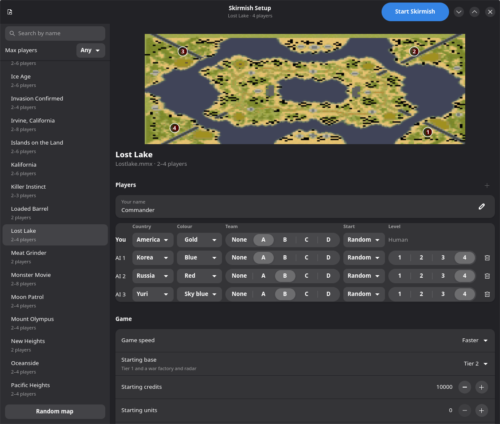
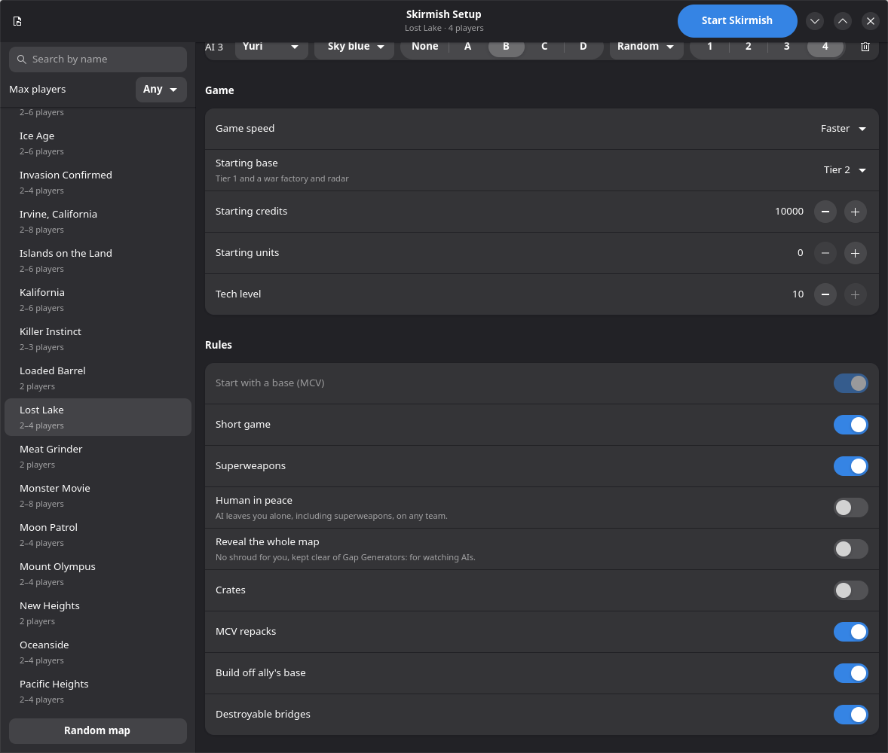

# Red Alert 2: Yuri's Revenge on Linux

Tools, mods and a rebuilt Brutal skirmish AI for the Steam release of **Command & Conquer: Red Alert 2
and Yuri's Revenge** (app 2229850), run under Proton.

- **Display setup:** a working high-resolution configuration (cnc-ddraw 6.3, Gamescope, a Wine DLL
  override) that keeps the skirmish menus usable.
- **Mods:** new units and buildings with their own art, balance changes, and larger Brutal AI armies.
  They are installed as loose files beside the game and uninstall cleanly.
- **Quick skirmish launcher:** a DLL that starts the game straight into a skirmish, with a GTK window
  to set it up. It also carries engine-level features the INI files can't express, most notably a
  **strategy director** for the Brutal AI.
- **Benchmarks:** unattended AI-vs-AI matches and unit-vs-unit arenas, run in parallel. Every AI and
  balance change was measured with these.

No game files are included. You need to own the game on Steam. Not affiliated with or endorsed by EA.

## What you get

### Display setup

The stock Steam release runs at 1024×768 through EA's DDrawCompat. This setup runs it at 2560×1440 (or
any resolution you choose) with:

- **cnc-ddraw 6.3.0.0** as `ddraw.dll` in the game directory, with the GDI renderer, and
  `windowed=false` in its `[gamemd]` section. In windowed mode the Skirmish menu's dropdowns
  disappear.
- **A Wine DLL override**, `ddraw=native,builtin`, so Proton loads that DLL instead of its own.
- **Gamescope** at the game's resolution, scaled to the monitor. The Steam launch option is
  `/usr/bin/python3 <repo>/yuri-gamescope.py %command%`.

### Mods (`mod/`)

`mod/build-tesla-mod.py install` writes `rulesmd.ini`, `artmd.ini`, `aimd.ini`, `ra2md.csf` and the art
into the game directory. It builds them from the stock files in the game's MIX archives and changes no
MIX file. Only Yuri's Revenge reads these files, and they apply to every launch, Steam's included.

| Addition | What it is |
|---|---|
| **Liberator** (`ATTNK`) | Allied Tesla tank with its own voxel model and cameo, immune to mind control, self-healing |
| **Bulldozer** (`SBDOZR`) | Soviet tracked siege vehicle with a blade, immune to mind control: the best building-razer for its price |
| **Cheat Defense** (`CHEATDEF`) | an observer's building: 1 credit, reveals the map, invulnerable, placeable up to 255 cells from your buildings; never built by the AI |
| **Balance** | more HP for the Rhino and Grizzly; dearer Gatling Cannon, Gatling Tank, Floating Disc and Slave Miner (with 4 slaves). Every change has its reason and numbers in `mod/build-tesla-mod.py` |
| **Brutal AI teams** (`combat_ai.py`, `oil_ai.py`) | 11–18-unit assault teams, working siege teams, naval and air teams, and oil derrick capture and guard. Easy and Normal stay stock |

### Quick skirmish launcher (`spawner/`)

`spawner/spawn.py install` builds `yspawn.dll` and writes `gamemd-spawn.exe`, a copy of the game's exe
that also loads the DLL. The stock `gamemd.exe` and the normal Steam launch are untouched. Games started
this way skip the intro and menus and exit when the match ends. They also get:

- **Skirmish Setup** (`spawner/skirmish.py`): a GTK 4 / libadwaita window with:
  - searchable maps with previews, including maps in subfolders of `Maps/`;
  - up to 7 opponents, with teams and start positions;
  - presets;
  - an AI level 4, which is Brutal with the strategy director.
- **Starting bases:** everyone starts with a tier of buildings instead of an MCV.
- **Human in peace:** the AI ignores you, so you can watch it play.
- **Test units:** units and buildings placed on the map at the start, from `[Units]` in `yspawn.ini`.
- **Magnetron carry:** your Magnetrons hold a lifted vehicle in the air and drop it where you choose.
- **Strategy director** (`director.h`, decisions in `director-policy.h`), for Brutal AI players.
  Stock Brutal AI sat on unspent money and attacked piecemeal. The director:
  - spends the money, picking units to counter the enemy's forces;
  - builds up war factories, refineries and expansions;
  - gathers one army and launches it only when it outvalues its target;
  - moves armies across water;
  - answers mind control;
  - picks a strategy (balanced, rush, boom, siege, naval).
- **Oil defences:** a Brutal AI fortifies threatened oil derricks.

<p>
  
  
</p>

The settings are keys in `spawner/yspawn.ini`, and the Skirmish Setup window writes that file. The keys
are documented in `spawner/yspawn.c` and `spawner/director.h` and, with examples, in `docs/DEVLOG.md`.

### Benchmarks (`spawner/bench.py`, `spawner/arena.py`)

- **`bench.py`** plays unattended AI-vs-AI matches: uncapped speed, 800×600, drawing one frame in 60. It
  writes per-house CSVs of economy, army and kills. Match sets compare the director with stock Brutal
  (`bench.py suite`), and seeds replay a game exactly.
- **`--jobs N`** plays N games at once, each in its own copy of the game directory and Proton prefix,
  without windows.
- **`arena.py`** fights equal-cost groups of two unit types against each other, or against a defended
  base, to measure counters.

## Requirements

- Linux with Steam.
- The game installed from Steam and started once, so its Proton prefix exists.
- Proton Experimental and Steam Linux Runtime 4.0 (Steam installs both).

| Needed | For |
|---|---|
| Python 3 (standard library) | every script |
| [Gamescope](https://github.com/ValveSoftware/gamescope) | the Steam launch option, `spawn.py run`, benchmarks |
| `numpy`, `Pillow` (in `mod/.venv`) | generating the mod art |
| `podman` | `spawner/build.sh`, which builds `yspawn.dll` with 32-bit mingw in a Fedora container (about 1 GB, first run only) |
| GTK 4, libadwaita, PyGObject in the system Python (`/usr/bin/python3`) | the Skirmish Setup window |
| a C compiler (`cc`) | the policy unit tests |
| `unicorn`, `pefile`, `capstone` (optional) | engine checks in the tests; skipped without them |
| KDE Plasma's `kscreen-doctor` (optional) | fitting Gamescope to the monitor, and `sunshine-display.py`. Without it, Gamescope picks the size itself |

The launcher patches `gamemd.exe` **1.001**, the version Steam ships. Other versions won't work.

## Setup

Close the game first, then run these from the repository folder:

1. **Display:** `./apply-working.sh`
   - It installs cnc-ddraw 6.3 through `install-renderer.py`, which downloads the release from GitHub and
     checks its SHA256.
   - It writes the tested `ddraw.ini`, sets 2560×1440 in `RA2MD.INI`, and adds the Wine override to the
     prefix.
   - For another resolution, pass it: `./apply-working.sh 1920x1080`.
   - Set the Steam launch option it prints, and choose **Yuri's Revenge** when Steam asks.
2. **Mod art:** these read stock pieces from the game's MIX files and write `mod/assets/`.

   ```sh
   python3 -m venv mod/.venv && mod/.venv/bin/pip install numpy pillow
   mod/.venv/bin/python mod/make_graphics.py
   mod/.venv/bin/python mod/cheatdef_art.py
   mod/.venv/bin/python mod/make_bulldozer.py
   ```
3. **Mods:** `python3 mod/build-tesla-mod.py install`
4. **Launcher:** `python3 spawner/spawn.py install`
5. **Play:** start the game from Steam as usual (the mods apply), or open
   `/usr/bin/python3 spawner/skirmish.py`. `--install-desktop` adds Skirmish Setup to the application
   menu. `python3 spawner/spawn.py run [MAP]` starts the match in `spawner/yspawn.ini` directly. Steam
   must be running.

**To undo:**
- Step 4: `python3 spawner/spawn.py uninstall`.
- Step 3: `python3 mod/build-tesla-mod.py uninstall`.
- Step 1: `./restore-stock.sh`. It removes cnc-ddraw and tells you to have Steam verify the game files
  and to remove the prefix override.

### Finding the game

The scripts find the game through Steam: `mod/ra2paths.py` looks for the library in
`libraryfolders.vdf` that holds the game. Run `python3 mod/ra2paths.py` to see what it found.
Environment variables override it:

| Variable | Default |
|---|---|
| `RA2YR_STEAM` | `~/.local/share/Steam`, `~/.steam/steam` or the Flatpak Steam |
| `RA2YR_GAME` | `<library>/steamapps/common/Command & Conquer Red Alert II` |
| `RA2YR_PREFIX` | `<library>/steamapps/compatdata/2229850` (the folder with `pfx/` in it) |
| `RA2YR_PROTON` | `Proton - Experimental/proton`, in any Steam library |
| `RA2YR_BENCH_FARM` | `<library>/ra2-bench-farm`: benchmark slots. Keep it on the prefix's filesystem, so copies are cheap |
| `RA2YR_OUTPUT` | the primary monitor (a `kscreen-doctor` output name such as `DP-2`) |

## Repository layout

| Path | Contents |
|---|---|
| `apply-working.sh`, `install-renderer.py`, `restore-stock.sh` | install and remove the display setup |
| `yuri-gamescope.py` | Steam launch wrapper: Gamescope at the game's resolution, fitted to the monitor |
| `sunshine-display.py` | Sunshine prep command: switches the monitor to the game's resolution while streaming, and back (KDE) |
| `mod/build-tesla-mod.py` | the mod installer: unit, building and balance definitions, and the INI and CSF patching |
| `mod/bulldozer.py`, `combat_ai.py`, `oil_ai.py` | the Bulldozer and the Brutal AI teams and triggers |
| `mod/make_graphics.py`, `cheatdef_art.py`, `make_bulldozer.py` | art generators: voxel models, building SHPs, cameos, previews |
| `mod/liberator_model.py`, `render.py` | the procedural Liberator model, and a preview renderer for voxels and SHPs |
| `mod/vxl.py`, `csf.py`, `mixextract.py` | readers and writers for Westwood formats (VXL/HVA, CSF strings, MIX archives) |
| `mod/fal_cameo.py`, `mod/cameo-art/` | painted cameo art made with an image model from a render (needs a fal.ai key) |
| `mod/previews/` | renders of the new units and buildings |
| `mod/MODDING-NOTES.md` | what was learned about the engine, file formats and art conventions, and the pitfalls |
| `spawner/yspawn.c` | the launcher DLL: skirmish setup from `yspawn.ini`, test units, starting bases, Magnetron carry |
| `spawner/director.h`, `director-policy.h` | the strategy director (engine hooks, and the pure decision rules) |
| `spawner/combat-ai.h`, `oil-defenses.h`, `human-peace.h` | other engine-level AI and rule features |
| `spawner/bench.h`, `team-telemetry.h` | benchmark mode and CSV logging inside the DLL |
| `spawner/spawn.py`, `add_import.py`, `build.sh` | build, install and launch |
| `spawner/skirmish.py`, `mappreview.py`, `startbase.py` | the Skirmish Setup window, map previews, starting-base tiers |
| `spawner/bench.py`, `arena.py`, `team_report.py`, `showcase.py` | benchmarks, unit arenas, team reports, unit line-ups to look at |
| `spawner/test_*.py`, `mod/test_*.py` | unit tests |
| `docs/DEVLOG.md` | the full development log: every change, experiment and benchmark result, and known limits |
| `docs/menu-fix-handoff-2026-09-15.md`, `logs/menu-investigation/RESULTS.md` | how the display setup was found |

## Development

- **Tests:**

  ```sh
  (cd mod && python3 -m unittest)
  (cd spawner && /usr/bin/python3 -m unittest)
  ```

  Tests that need the installed game, a debug DLL or the optional emulator modules skip without them.
- **Rebuild the DLL** after changing `spawner/*.c`/`*.h`: `python3 spawner/spawn.py install`.
- **Measure an AI change:** `python3 spawner/bench.py suite OUTDIR --jobs 4`, or
  `--dll PATH` to test a build without installing it. For one match, use
  `bench.py run OUTDIR MAP COUNTRY:START:DIRECTOR ...` with `--seed N` to replay it. `bench.py summary`
  and `bench.py ab` read the results.
- **Logs:** `yspawn.log` in the game directory records each launcher step. A crash writes `except.txt`
  there, and its `Eip` shows where it happened.
- **Engine addresses** are for `gamemd.exe` 1.001. They come from the
  [YRpp](https://github.com/Phobos-developers/YRpp) headers and CnCNet's
  [yrpp-spawner](https://github.com/CnCNet/yrpp-spawner); `spawner/yspawn.c` notes where.

## Troubleshooting

- **Skirmish dropdowns are missing:** `[gamemd]` in `ddraw.ini` must have `windowed=false`. Run
  `./apply-working.sh` again.
- **The game ignores cnc-ddraw:** check that `grep -i ddraw /proc/$(pgrep -x gamemd.exe)/maps` shows the
  game directory's `ddraw.dll`. If it doesn't, the Wine override is missing from the prefix.
- **Black screen at start with many maps:** keep big map packs in subfolders of `Maps/`, not in the
  game directory itself. Wine's case-insensitive lookups in a crowded directory stall the start.
  Skirmish Setup finds maps in subfolders.
- **The launcher does nothing:** Steam must be running, and the game must be closed.
- **Resolutions above 2560×1440:** 5120×1440 crashed the engine. Keep the game at 2560×1440 or below and
  let Gamescope scale it.

Base Red Alert 2 was not fully tested; everything here targets Yuri's Revenge. The setup was built on
Bazzite with KDE Plasma on Wayland. Known AI limits and open crashes are listed at the end of
`docs/DEVLOG.md`.

## License

GPL-3.0-or-later, see `LICENSE`. The launcher builds on engine addresses and layouts from the GPL-3 projects
YRpp and yrpp-spawner. Red Alert 2 and Yuri's Revenge are EA's. This repository contains none of their
files: the mod art is generated locally, from the game's own archives where it needs stock pieces.
